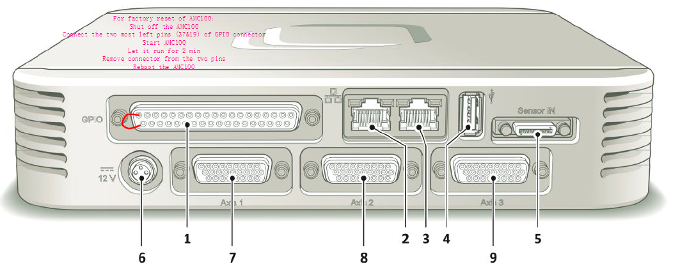

# RESET

For factory reset of AMC100:

Shut off the AMC100

Connect the two most left pins (37 and 19) of GPIO connector

Start AMC100

Let it run for 2 min

Remove connector from the two pins

Reboot the AMC100

 

